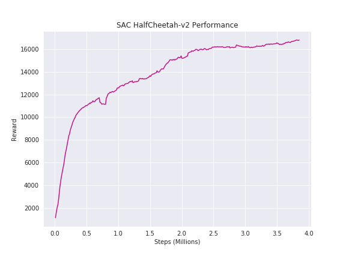
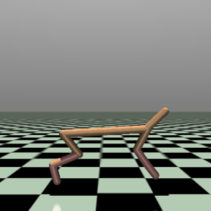
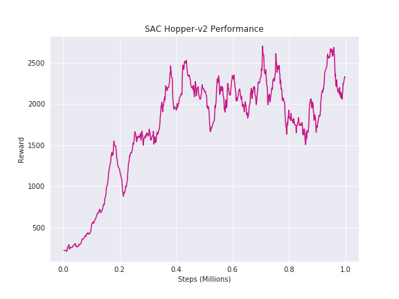
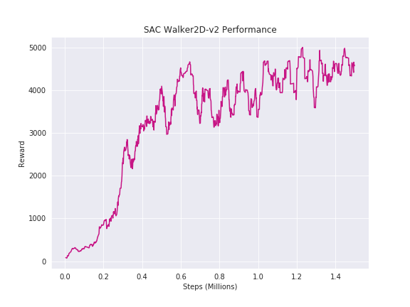

# Soft Actor Critic in PyTorch

A relatively minimal PyTorch SAC implementation from scratch. Uses a numerically stable Tanh Transformation to implement action sampling and log-prob calculation.

## Quick Start

Simply run:

`python train_agent.py`

for default args. Changeable args are:
```
--env: String of environment name (Default: HalfCheetah-v2)
--seed: Int of seed (Default: 100)
--use_obs_filter: Boolean that is true when used (seems to degrade performance)
--update_every_n_steps: Int of how many env steps we take before optimizing the agent (Default: 1, ratio of steps v.s. backprop is tied to 1:1)
--n_random_actions: Int of how many random steps we take to 'seed' the replay pool (Default: 10000)
--n_collect_steps: Int of how steps we collect before training  (Default: 1000)
--n_evals: Int of how many episodes we run an evaluation for (Default: 1)
--save_model: Boolean that is true when used (saves model when GIFs are made, loading and running is left as an exercise for the reader (or until I get around to it))
```

## Results

Single seed runs (smoothed)

| Graph                                 |  Gif
:--------------------------------------:|:------------------------------------:
|   | 
|        | 
|      | 
